# Generate Image With GAN
> This is an example of GAN,how to generate mnist and faces image.

## How to Use

**1、i have implemented the GAN Model with tensorflow,you just download the project.**

**2、prepare data.download mnist data from http://yann.lecun.com/exdb/mnist/ ,faces data is very rich,you can download anything.**

**3、when data is prepared,just run the face_gantest.py for training and generating face images,run the mnist_gantest.py for training and generating mnist images.**

**4、training the model on the GTX1080,it takes several hours,if you need,i will share those trained model,but it not very difficult,you can try on your own.**

## Result

** mnist training result**

*0_epoch*

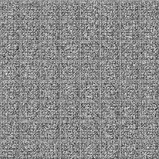

*50_epoch*

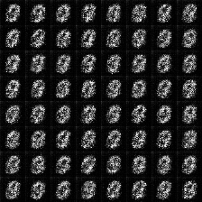

*100_epoch*

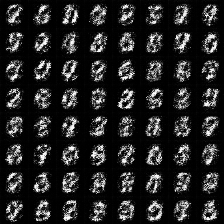

*500_epoch*

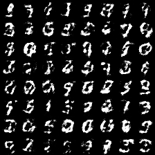

*1000_epoch*

*10000_epoch*

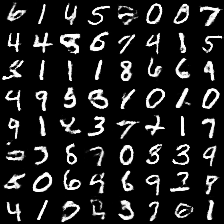

*50000_epoch*

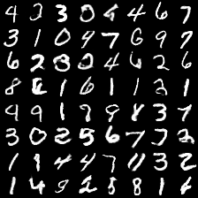

** faces training result**

*0_epoch*

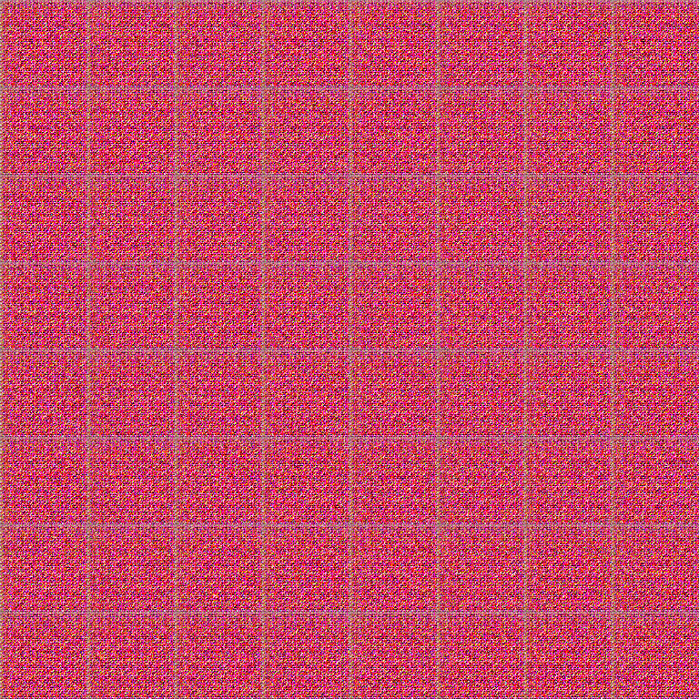

*50_epoch*

*100_epoch*

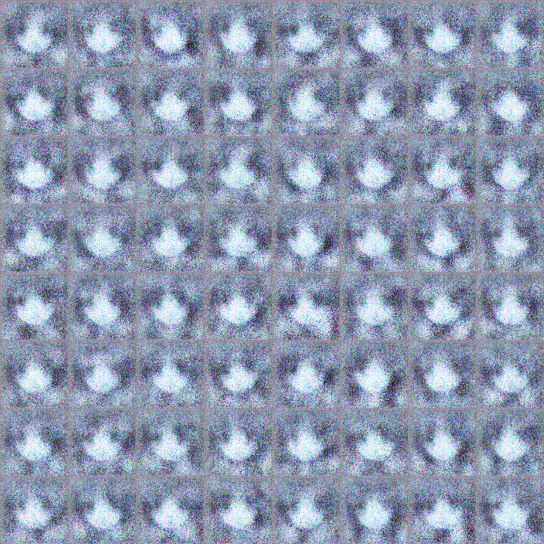

*500_epoch*

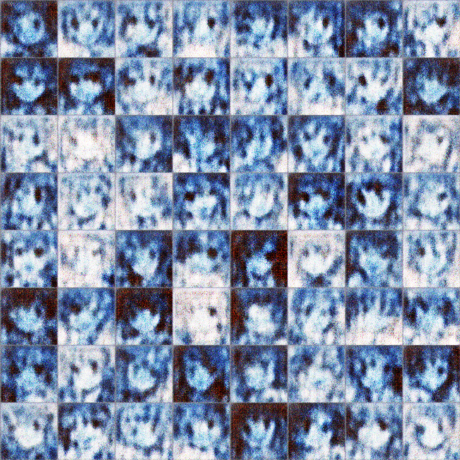

*1000_epoch*

*5000_epoch*

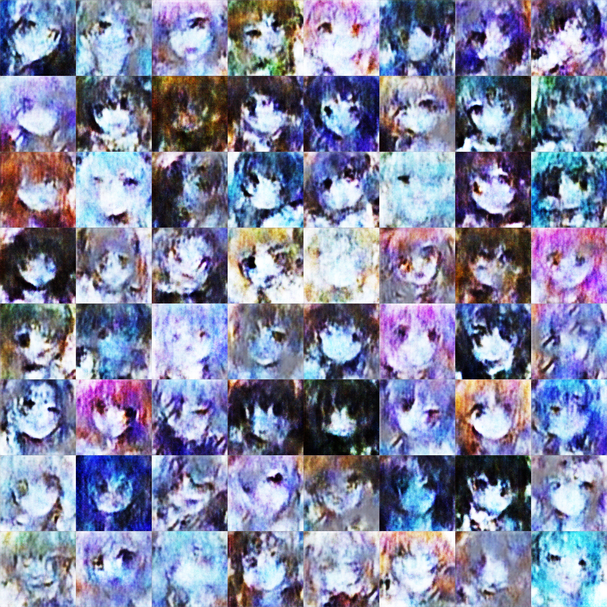

*10000_epoch*

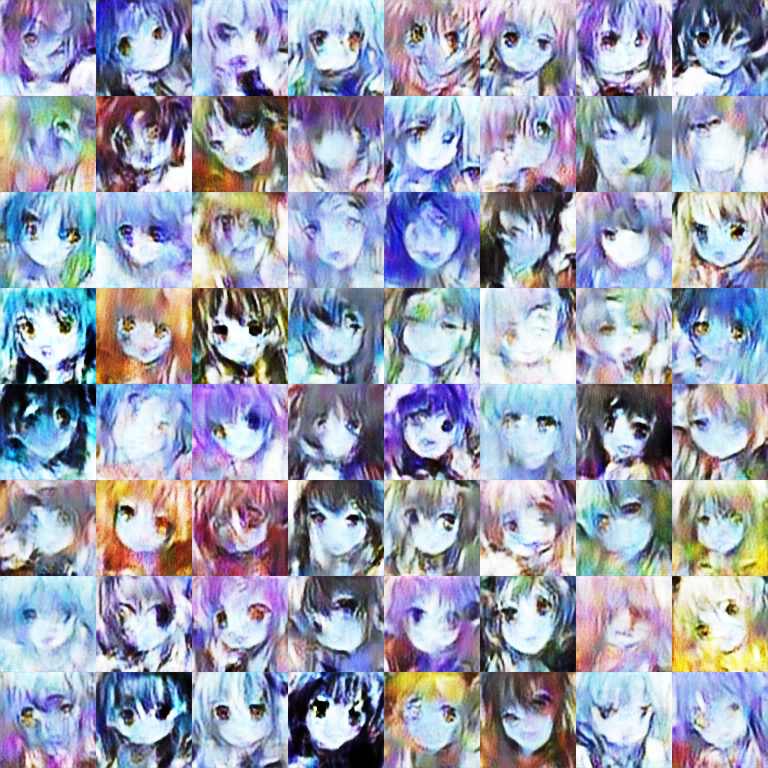

*49999_epoch*

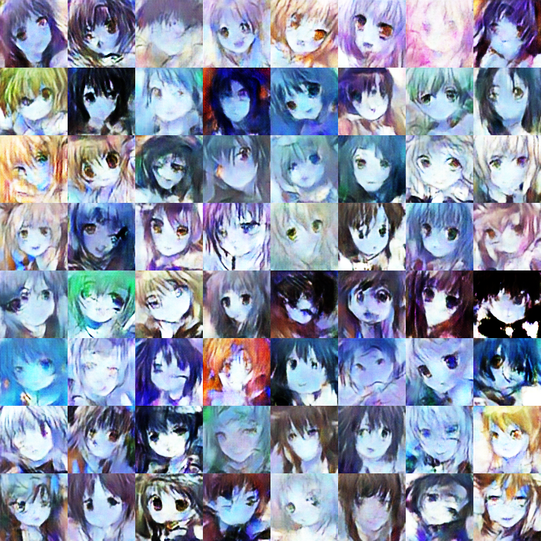

## Contact
* https://github.com/junqiangchen
* email: 1207173174@qq.com
* WeChat Public number: 最新医学影像技术
